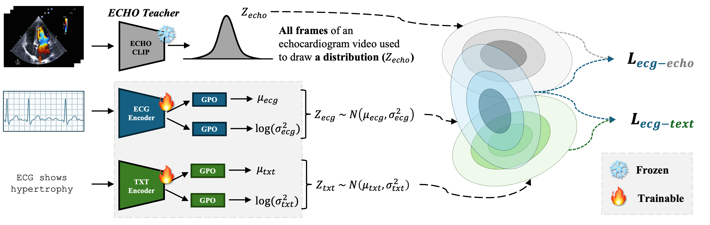

# EchoingECG (MICCAI 2025)

EchoingECG is a probabilistic student-teacher model designed to improve cardiac function prediction from electrocardiograms (ECGs) by distilling knowledge from echocardiograms (ECHO). This approach leverages uncertainty-aware ECG embeddings and ECHO supervision, integrating Probabilistic Cross-Modal Embeddings (PCME++) and ECHO-CLIP, a vision-language pretrained model, to transfer ECHO knowledge into ECG representations.

## Features
- ECHO-CLIP knowledge distillation
- Probabilistic contrastive learning with PCME++
- Outperforms state-of-the-art ECG models for ECHO prediction

## Figure


## Installation
Clone the repository and install dependencies:
```bash
git clone https://github.com/mcintoshML/EchoingECG.git
cd EchoingECG
pip install -r requirements.txt
```

## Quick Start: Run EchoingECG in Jupyter Notebook
Below is an example workflow using the provided demo notebook:

```python
import sys
import yaml
import torch
from src.model.echoingecg_model import EchoingECG

# Load model config
with open("src/configs/model.yaml") as f:
    model_cfg = yaml.safe_load(f)
model = EchoingECG(model_cfg)
model_weights = torch.load("echoingecg.pt", weights_only=True, map_location="cpu")
model.load_state_dict(model_weights)

# Example ECG input
dummy_ecg = torch.zeros((1, 12, 1000)) # 10 seconds at 100Hz, 12 leads
input = {"ecg": dummy_ecg}
output = model(input)
print(output["ecg"].keys()) # 'mean' and 'std' (probabilistic)
print(output["ecg"]["mean"].shape, output["ecg"]["std"].shape)

# Example text input
from transformers import AutoTokenizer
text_example = "ecg is normal"
tokenizer = AutoTokenizer.from_pretrained("dmis-lab/biobert-v1.1", return_pt=True)
tok_dict = tokenizer(text_example)
input_model = {
    "text": torch.tensor(tok_dict["input_ids"]).unsqueeze(0),
    "attention_mask": torch.tensor(tok_dict["attention_mask"]).unsqueeze(0)
}
output = model(input_model)
print(output["text"].keys()) # 'mean' and 'std'
print(output["text"]["mean"].shape, output["text"]["std"].shape)

# Load and scale an ECG properly
from src.datasets.helpers import scale_ecg
import joblib
import numpy as np
sc = joblib.load("ecg_scaler.pkl")
_center = torch.from_numpy(sc.mean_.astype(np.float32))
_scale = torch.from_numpy(sc.scale_.astype(np.float32)).clamp_min(1e-8)
dummy_ecg = torch.zeros((1,12,1000))
scaled_output = scale_ecg(_center, _scale, dummy_ecg)
```

## Citation
If you use EchoingECG in your research, please cite:
```
@InProceedings{GaoYua_EchoingECG_MICCAI2025,
        author = { Gao, Yuan and Kim, Sangwook and McIntosh, Chris},
        title = { { EchoingECG: An Electrocardiogram Cross-Modal Model for Echocardiogram Tasks } },
        booktitle = {proceedings of Medical Image Computing and Computer Assisted Intervention -- MICCAI 2025},
        year = {2025},
        publisher = {Springer Nature Switzerland},
        volume = {LNCS 15964},
        month = {September},
        page = {175 -- 185}
}
```

## License
This work is licensed under the **Creative Commons Attribution-NonCommercial-NoDerivatives 4.0 International License (CC BY-NC-ND 4.0)**.

You may share this work for non-commercial purposes, with proper attribution, but you may not modify it or use it commercially.

[](https://creativecommons.org/licenses/by-nc-nd/4.0/)

[View Full License Details](https://creativecommons.org/licenses/by-nc-nd/4.0/)